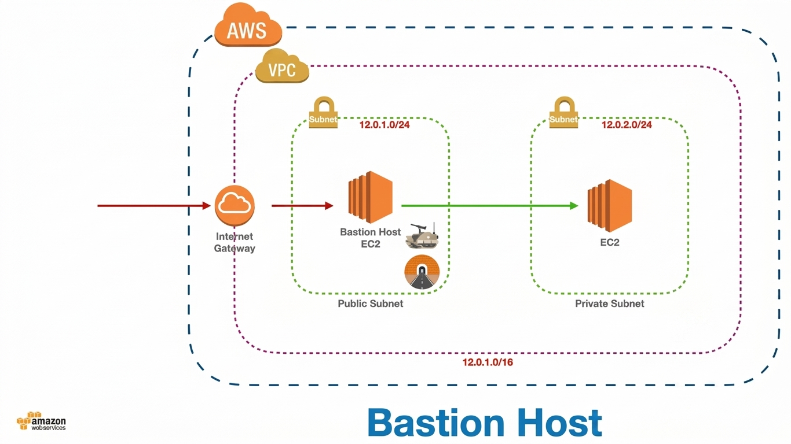

# AWS Bastion Host – Secure Administrative Access


## Overview

This project demonstrates the implementation of a Bastion Host architecture in Amazon Web Services (AWS) to provide controlled administrative access to an EC2 instance located inside a private subnet.

The main objective was to separate the publicly accessible administrative entry point from the private workload, reducing direct exposure of the internal EC2 instance to the internet.

This project was built as a hands-on cloud security lab to understand AWS networking, EC2 deployment, route tables, security groups, and secure administrative access.

---

## Architecture



The architecture consists of:

* One custom VPC
* One public subnet
* One private subnet
* An Internet Gateway
* Separate public and private route tables
* A Bastion Host EC2 instance
* A private EC2 instance
* Security Groups controlling network access

### Traffic Flow

```text
Administrator
      │
      │ RDP
      ▼
Internet Gateway
      │
      ▼
Public Subnet
12.0.1.0/24
      │
      ▼
Bastion Host
EC2
      │
      │ Controlled Administrative Access
      ▼
Private Subnet
12.0.3.0/26
      │
      ▼
Private EC2
No Public IPv4
```

---

## Project Objectives

* Design a custom AWS VPC
* Create separate public and private subnets
* Configure route tables for network segmentation
* Deploy a Bastion Host in the public subnet
* Deploy an EC2 instance in the private subnet
* Configure Security Groups
* Test administrative connectivity
* Verify private instance accessibility through the Bastion Host
* Understand the security limitations of the implementation
* Identify improvements required for a production environment

---

## AWS Services Used

| AWS Service      | Purpose                                             |
| ---------------- | --------------------------------------------------- |
| Amazon VPC       | Provides the isolated cloud network                 |
| Amazon EC2       | Hosts the Bastion Host and private workload         |
| Internet Gateway | Provides internet connectivity to the public subnet |
| Route Tables     | Controls traffic routing between network components |
| Security Groups  | Controls inbound and outbound traffic               |
| RDP              | Used for Windows administrative access              |

---

## Network Configuration

| Component               | Configuration     |
| ----------------------- | ----------------- |
| VPC                     | `12.0.0.0/16`     |
| Public Subnet           | `12.0.1.0/24`     |
| Private Subnet          | `12.0.3.0/26`     |
| Public Route Table      | `demo-public-RT`  |
| Private Route Table     | `demo-private-RT` |
| Bastion Host            | EC2               |
| Private Workload        | EC2               |
| Instance Type           | `t3.micro`        |
| Administrative Protocol | RDP               |

---

## Implementation

### 1. VPC

A custom VPC was created with the CIDR block:

```text
12.0.0.0/16
```

This provides the overall address space for the project.

---

### 2. Public Subnet

The public subnet was configured with:

```text
12.0.1.0/24
```

The Bastion Host was deployed inside this subnet because it requires controlled connectivity from the administrator.

The public route table contains a route to the Internet Gateway.

---

### 3. Private Subnet

The private subnet was configured with:

```text
12.0.3.0/26
```

The internal EC2 instance was deployed here without a public IPv4 address.

This prevents direct internet-based access to the private workload.

---

### 4. Route Tables

Two route tables were configured.

#### Public Route Table

```text
Destination       Target

12.0.0.0/16       local
0.0.0.0/0         Internet Gateway
```

The public route table was associated with the public subnet.

#### Private Route Table

The private subnet was associated with a separate route table so that the private workload was not directly exposed through an Internet Gateway route.

---

### 5. Bastion Host

An EC2 instance was deployed in the public subnet to act as the Bastion Host.

The Bastion Host provides the administrative entry point into the environment.

Instead of exposing the private EC2 instance directly to the internet, administrative access is routed through the Bastion Host.

---

### 6. Private EC2 Instance

A second EC2 instance was deployed inside the private subnet.

The instance does not have a public IPv4 address.

This provides an additional layer of network isolation between the private workload and the public internet.

---

### 7. Security Group

Security Groups were configured to control access to the EC2 instances.

During the lab, RDP was used for Windows administration.

```text
Protocol: TCP
Port: 3389
Service: RDP
```

---

## Security Considerations

The key security principle demonstrated by this project is:

> **Do not expose private workloads directly to the public internet when administrative access can be isolated through a controlled entry point.**

The Bastion Host acts as the controlled administrative boundary between the public internet and the private workload.

The private EC2 instance does not have a public IPv4 address, which significantly reduces its direct exposure.

---

## Security Limitation

During testing, RDP access to the Bastion Host was temporarily configured using:

```text
TCP 3389
Source: 0.0.0.0/0
```

This configuration was used only to test connectivity.

It is **not recommended for a production environment** because it allows connection attempts from any IPv4 address.

A production implementation should restrict administrative access to trusted IP ranges or use stronger access mechanisms.

---

## Recommended Production Improvements

The following improvements would make the architecture more suitable for a real production environment:

* Restrict RDP access to a known administrative IP range
* Avoid exposing RDP directly to the public internet
* Use AWS Systems Manager Session Manager where possible
* Use VPN or private connectivity for administrative access
* Apply IAM least-privilege principles
* Enable VPC Flow Logs
* Enable AWS CloudTrail
* Enable Amazon GuardDuty
* Enable CloudWatch monitoring
* Encrypt EBS volumes
* Enable MFA for administrative identities
* Implement infrastructure as code using Terraform
* Centralize security monitoring and logging

---

## Implementation Evidence

The `screenshots/` directory contains screenshots captured during the implementation process.

The evidence covers:

* VPC configuration
* Public subnet configuration
* Private subnet configuration
* Route table configuration
* EC2 deployment
* Security Group configuration
* Bastion Host configuration
* Private EC2 configuration
* RDP connectivity
* Final architecture

---

## Project Report

A detailed implementation report is available here:

[View the Complete Project Report](docs/AWS_Bastion_Host_Project_Report.pdf)

---

## Key Learning Outcomes

Through this project, I gained practical experience with:

* AWS VPC architecture
* CIDR addressing
* Public and private subnet design
* Route tables
* Internet Gateways
* EC2 deployment
* Security Groups
* Bastion Host architecture
* Network segmentation
* Administrative access controls
* Cloud security fundamentals
* Security architecture analysis

---

## Future Development

This project can be extended into a more production-oriented cloud security architecture by implementing:

1. AWS Systems Manager Session Manager
2. IAM least-privilege access
3. VPC Flow Logs
4. CloudTrail monitoring
5. GuardDuty threat detection
6. CloudWatch security monitoring
7. Terraform infrastructure automation
8. Automated security validation

---

## Author

**Shubham Bhatti**

B.Tech Cybersecurity
Marwadi University

**Aspiring Cloud Security Engineer**

GitHub: [SHUBS2007](https://github.com/SHUBS2007)

LinkedIn: [Shubham Bhatti](https://www.linkedin.com/in/shubham-bhatti2007/)

---

## Disclaimer

This project was created as a learning and academic cloud security lab.

The configuration demonstrated in this repository should not be considered production-ready without additional security hardening, monitoring, access controls, and operational controls.
